# Update from Berlin  

Hey Maddie

I miss you a lot. It’s hard to find time to Skype since I’m getting ready for bed when you get out of work and I’m at work (or sightseeing) when you’re getting ready to go so I thought I’d write you this status update.   

I think the last time I was able to talk to you was when I was with Nora, and then briefly a few times on couple. Here is what has happened since.  

Nora and I had the best day ever of brother sister bonding at the Tower of London. I look constipated in the picture but that is just because it is bright.  

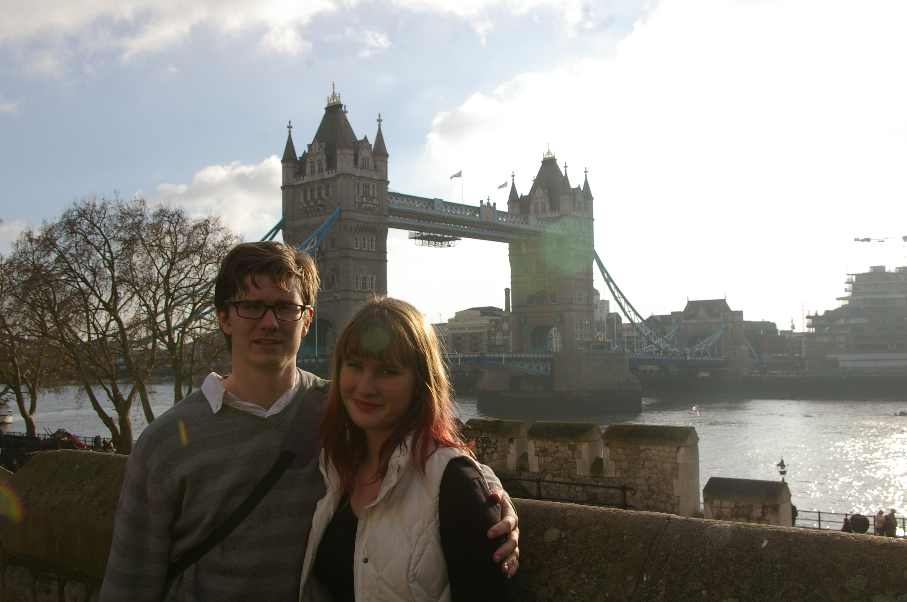

We ran into this kid Nate that Nora knows and he took lot of pictures for us. This is us in front of Tower Bridge next to the Tower of London. We also saw Parliament and Big Ben.  

Us in front of the White Tower at Tower of London. The original tower built in 1078 as a fortress and palace for William the Conquerer.  

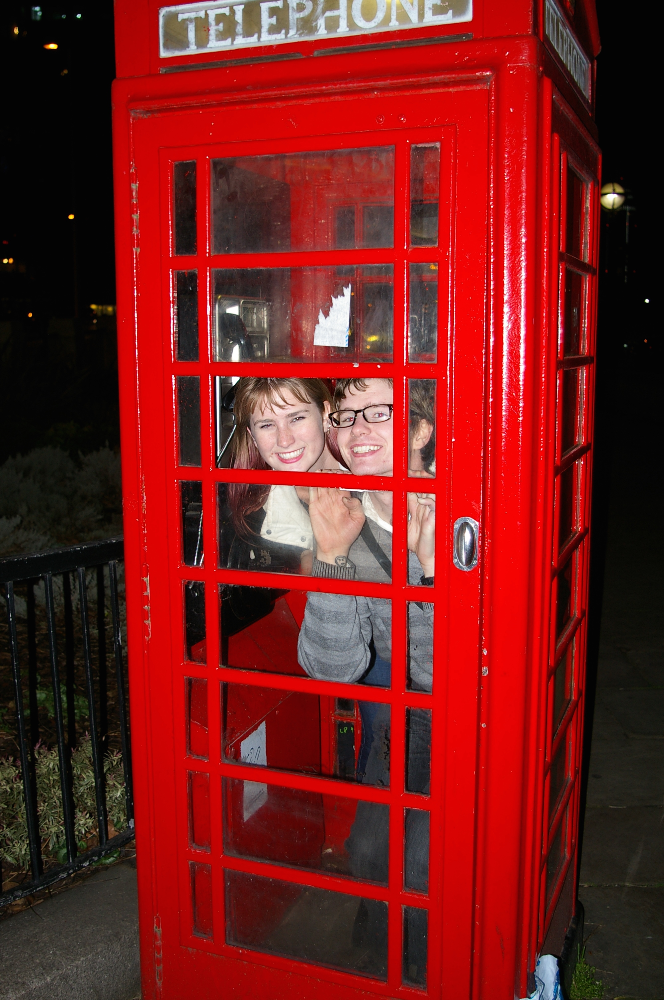
Us in a phone booth near Big Ben.  

That was a fun evening. We settled down to do some work in a pub and that’s when we skyped.  

Next morning we’re up on time and I get Nora successfully to her train. We really had a great time and I’m glad she was able to come although I wish you had been there. London was much better this time around and we should totally go back. It’s wicked cool. Also I finally had my big english breakfast.

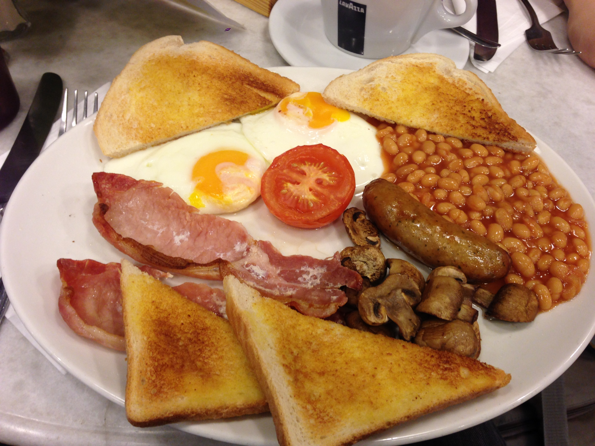
It was as good as it looks.

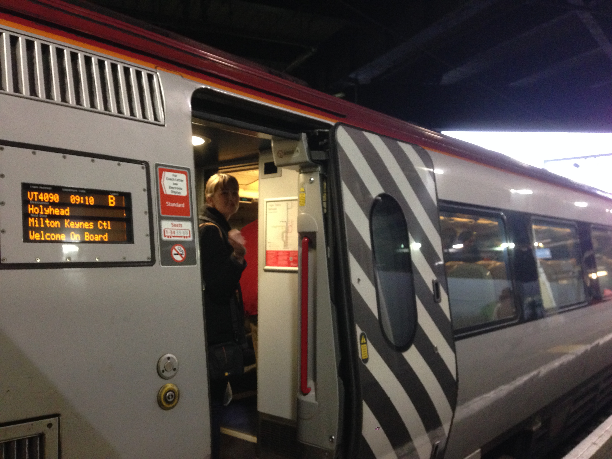
Goodbye Nora!

After I dropped Nora off I went and found a cafe and “worked” all day. I mostly just sat around and watched Netflix while waiting for my train. I tried to make myself work but it was really really hard. I did end of chatting with Alice about my goals for the week.

This Ryanair flight was again really weird. The express train was completely packed but the airport was less busy. I tried to tape the experience of going through the duty-free zone but they told me to stop. I had to take a tram this time to my gate like the Pittsburgh airport.

I got to Berlin just fine.
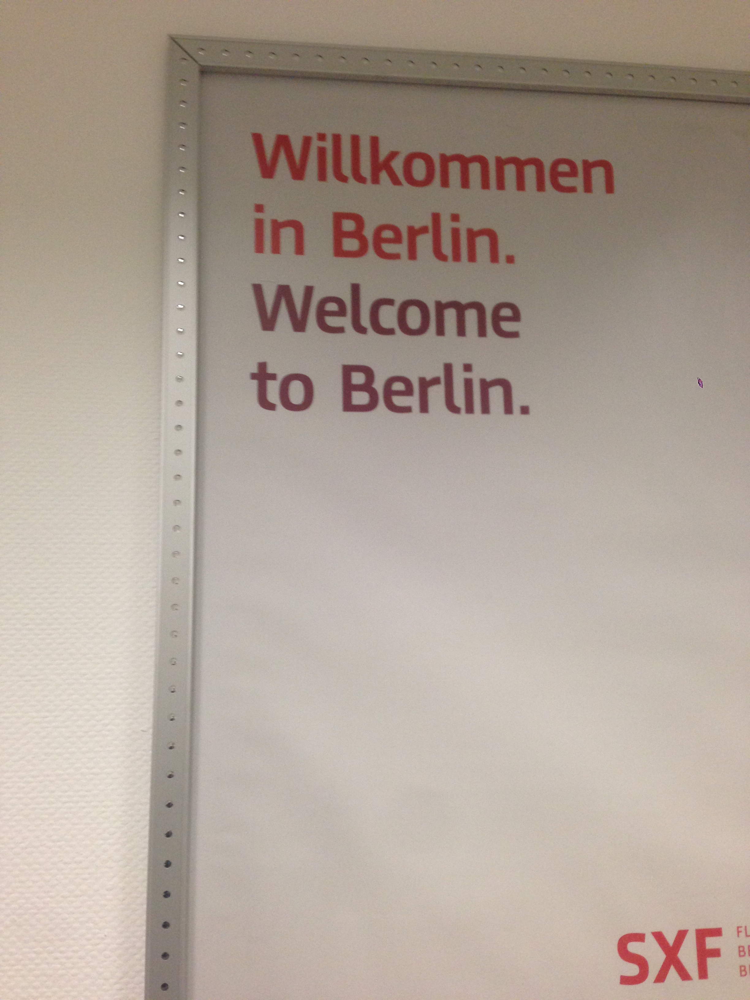

PJ picked me up at the airport and we went back to his place. I don’t have any pictures of his apartment or his office yet but I will get some. Met Viv, had doner for dinner. It’s like a gyros. 

Next day: (we’re on Tuesday now) I go into the office with PJ. We’re on the third floor of an old apartment building. He works for TapTap, a wallpaper discovery app for android. Basically instead of searching for a picture and setting it as your background, they found a hack where they can keep their app open all the time running in the background. All you do is double tap anywhere on the screen and it changes your background. It’s pretty cool. You can like different backgrounds and it will learn your preferences and suggest photos it thinks you will like. The team right now is four people with PJ who is the first hire. The other three are all german and they’re the founders. They all work together in one room on a floor with three other companies that are also all small. I mentioned the odd office to PJ and he says that this is really common here. They don’t have lots of blocks of office buildings.

I worked rather late with them and then PJ and I went to a British burger bar halfway between his office and home.

 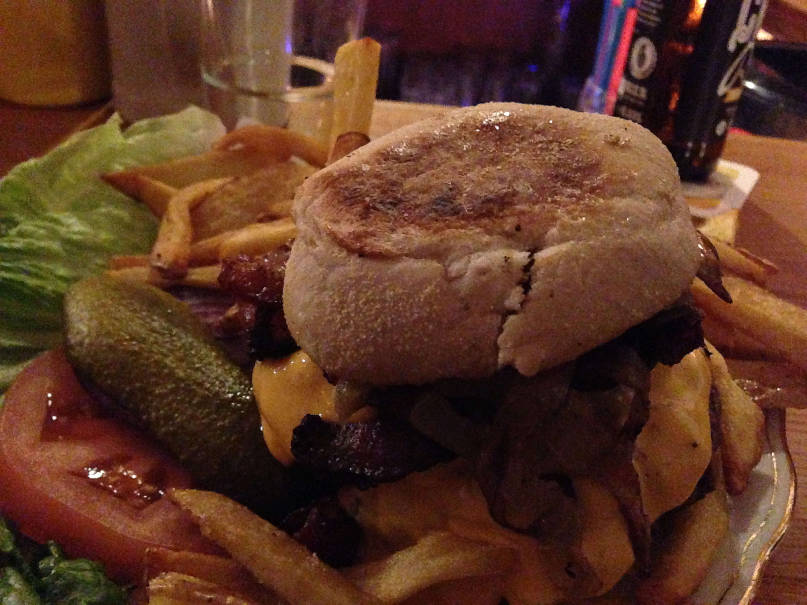
 
 This burger was served on an english muffin instead of a bun! I also learned from the bartender (who is a British citizen ex-pat working in Berlin) that english muffins are NOT crumpets. Totally different. Crumpets are more like biscuits (american biscuits not British biscuits which are cookies). So you were right.

Now we come to today. Today I slept in a little bit and then headed off on my own to see Berlin. I ended up walking through a good part of town down their main historic strip. I saw a lot of cool buildings. I’m not sure what any of them were, which I intend to look up later.

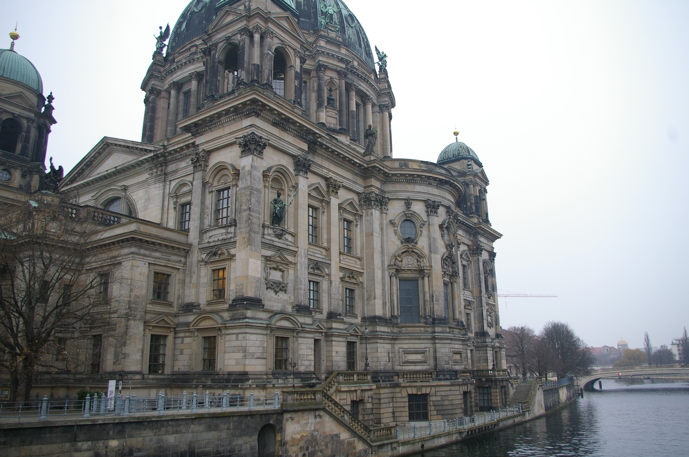
An old church?

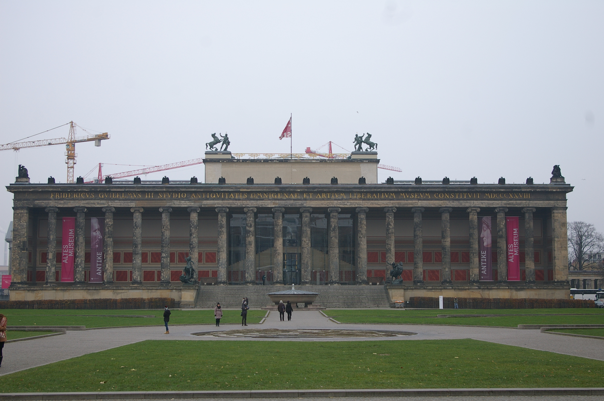
National museum perhaps?

Something I noticed was that the whole city seemed to be under construction. There was evidence everywhere. And not just of road construction but huge projects everywhere. 

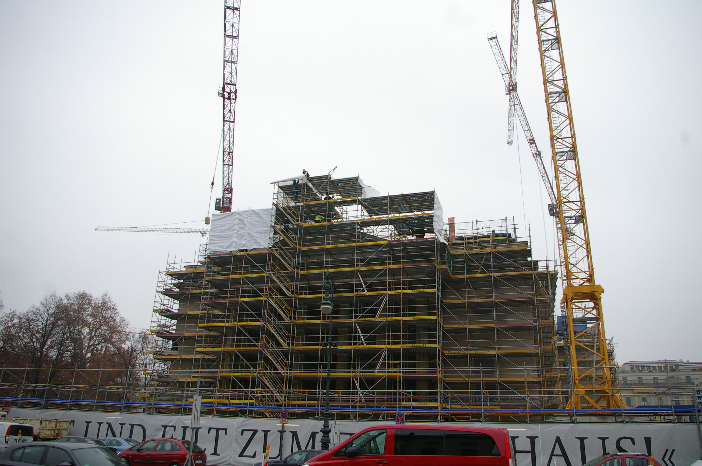

Sometimes it was every other building along a strip. Clearly there is money flowing into Berlin right now.

Finally I reached Brandenburg Gate. Napoleon marched through here. So did Hitler. It was in East Berlin for a while and now it’s a symbol of the reunification.

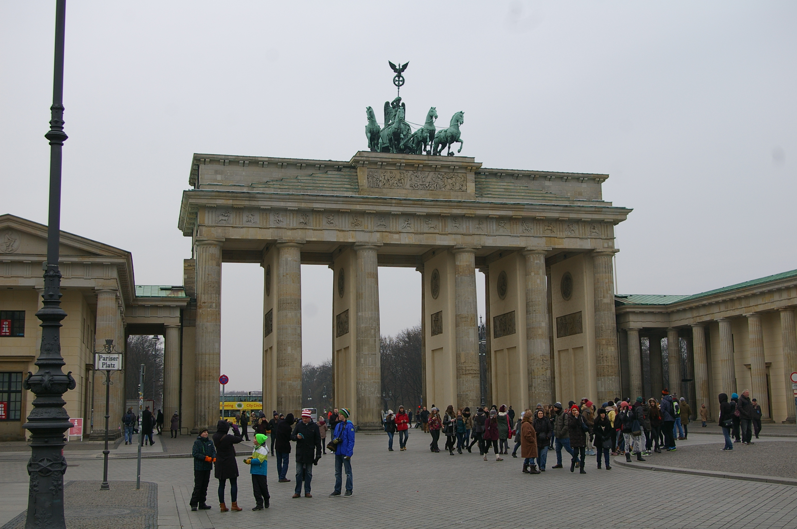

Then I snapped a selfie

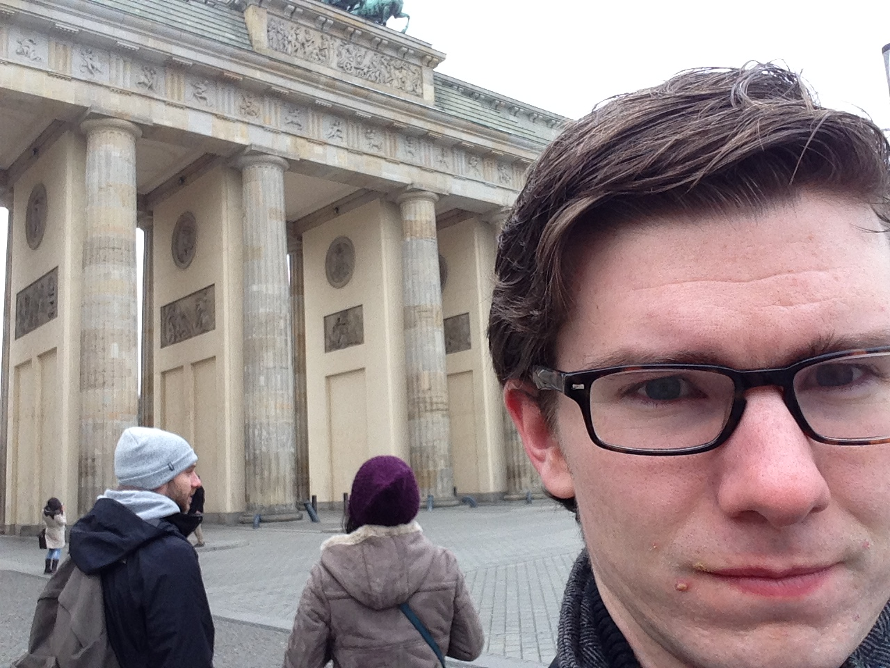
Hi it’s me! What do I do with my face? I don’t know I’ll just scowl slightly.

Brandenburg Gate was interesting but I really wanted to see the wall. I walked over to the Berlin Wall Memorial and Museum. It. Was. So. Cool.

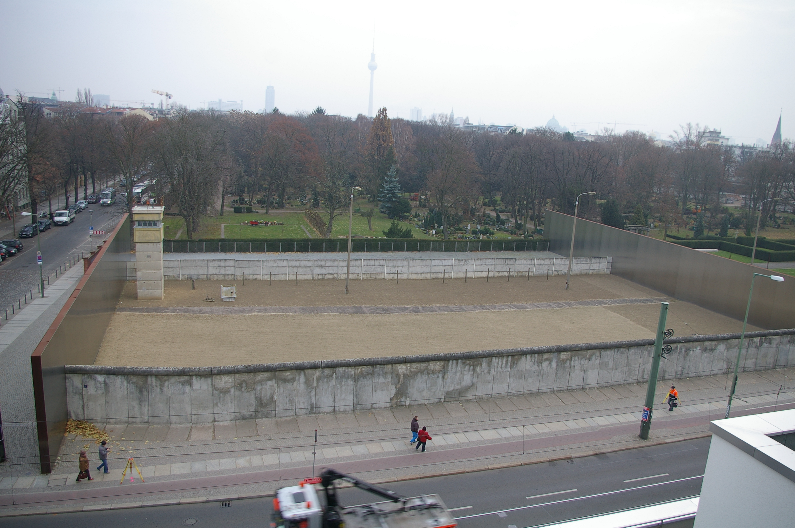
Here’s a section of preserved border. The wall in front. Then smooth dirt to track footprints. A tripwire in the middle, guard tower, then another wall behind. The “Berlin Wall” is the one in the front. It’s probably 10 feet high.

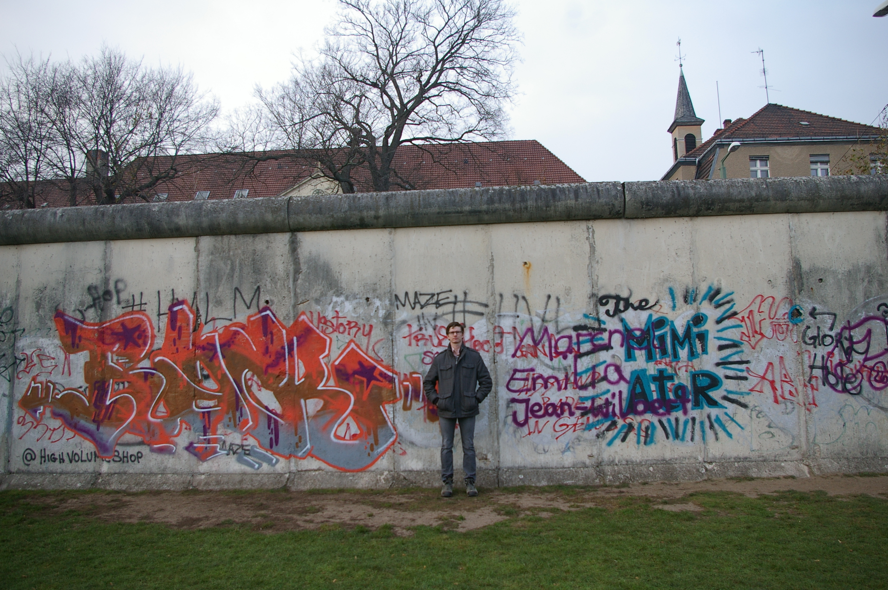
Me at the wall. I felt odd smiling.

Anyway, that is just about everything. I started writing this email at work and now I’m back and it’s late and I’m about to go to bed. 

Goodnight and I love you!

Scott